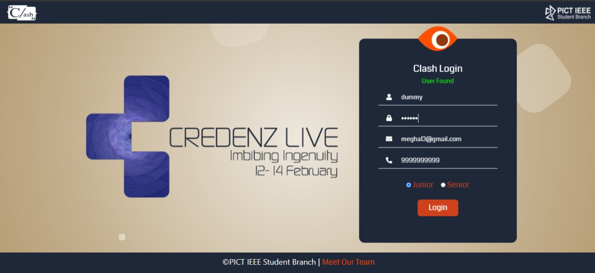
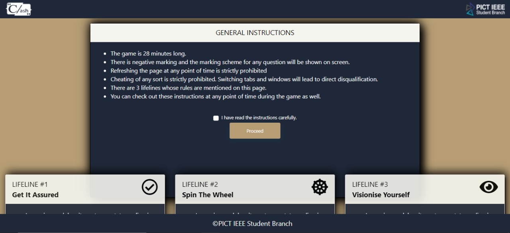
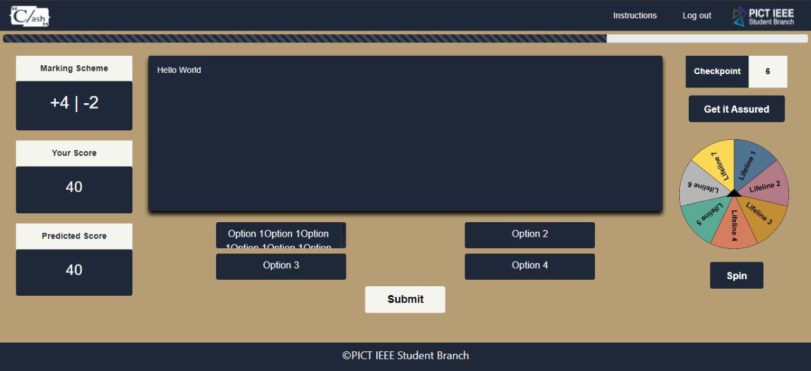
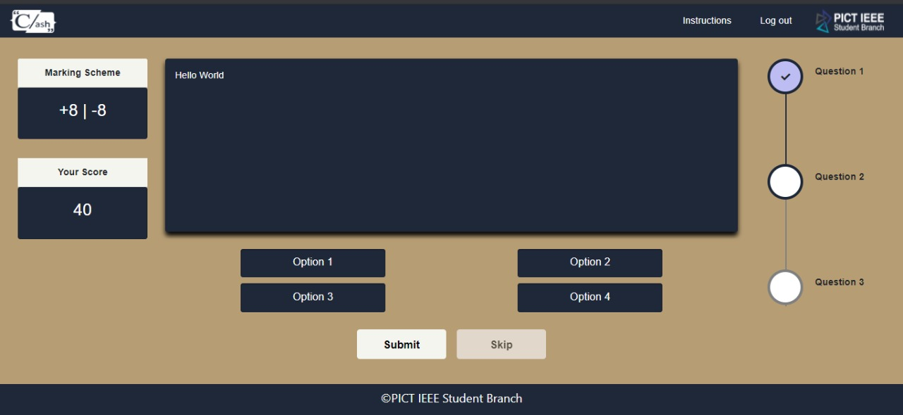
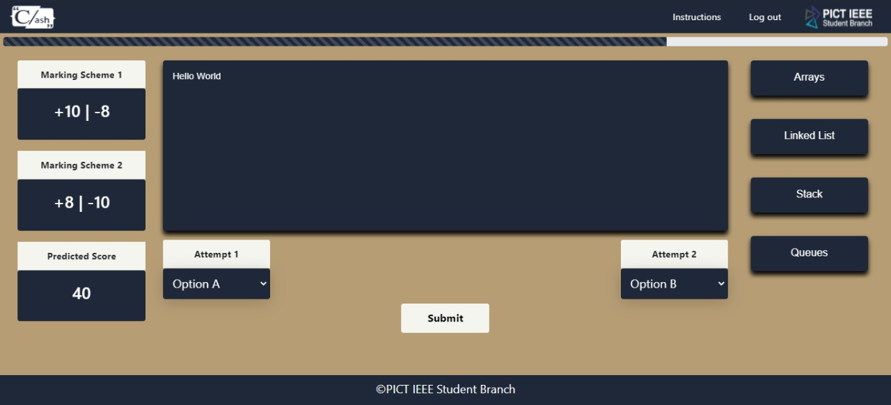
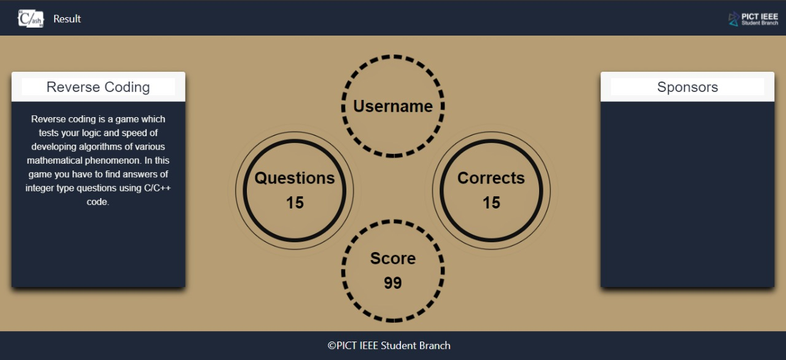

# Clash-Round-1
MCQ Platform based on the theme, Vision. It was built to test the logical aptitude of participants during Credenz, which is a technical event organised by PISB. This 28 minutes long quiz comprising multiple-choice questions on C, C++ and Python also had 3 different lifelines that could be availed at certain points during the game.

## Steps to run the project:
	
**Requirements:** Python and pip must be installed in your system.

### 1) Clone the project onto your local machine.

	git clone https://github.com/meghadandapat/Clash-Round-1.git

### 2) Create a virtual environment and install the required packages.

create a virtual envirnoment:

	python3 -m venv clashvenv

activate this virtual envirnoment:

	cd clashvenv/Scripts/activate

installing all required packages which are present in requirement.txt:

	python -m pip install -r requirements.txt

### 3) Start the development server:

	python manage.py runserver

## User Interface of the platform:
#### 1) Login

### 2) Instructions

### 3) Spin the Wheel

### 4) Visionise

### 5) Get It Assured

### 6) Results

